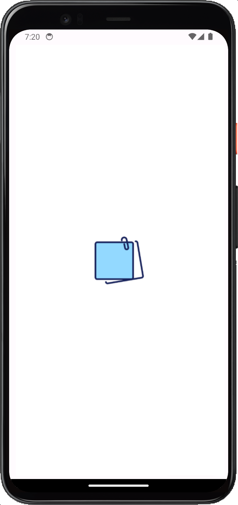
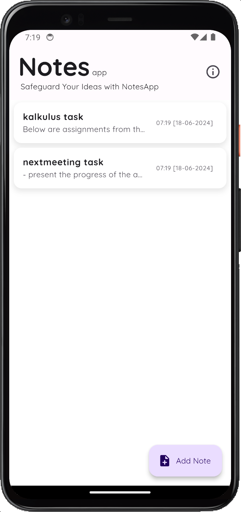
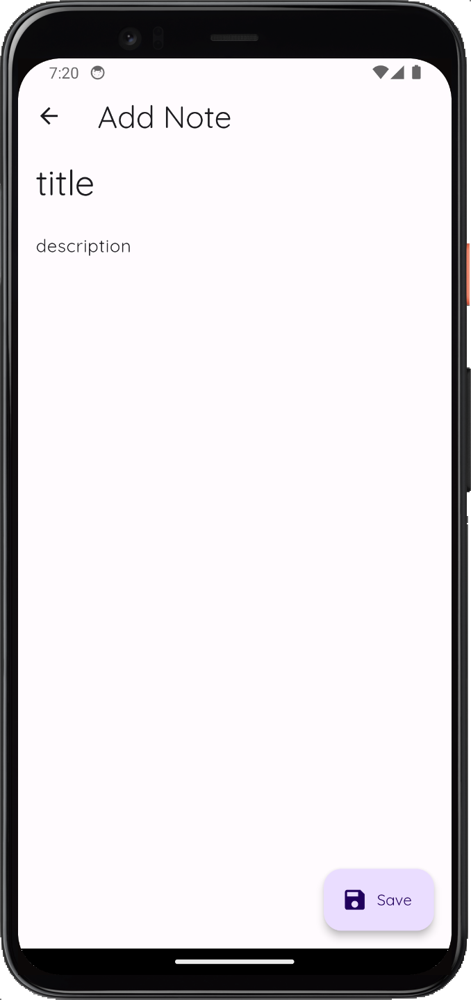

# NotesApp Mobile

NotesApp is a note-taking application that allows users to create, edit, and delete their notes. This application uses Flutter local storage with sqflite to store and retrieve note data locally on the device.

## Features

- **Create New Note**: Users can create new notes with a title and content.
- **Edit Note**: Users can edit existing notes.
- **Delete Note**: Users can delete notes that are no longer needed.
- **View Note Details**: Users can view the full details of each note.

## Technologies Used

### Frontend
- **Dart**: The main programming language used for developing this application.
- **Flutter**: A framework for building responsive and attractive user interfaces.

### Dependencies
- **sqflite**: To handle local database storage.
- **path_provider**: To find commonly used locations on the filesystem.
- **initl**: To format dates and other localization needs.


## Installation

1. **Clone this Repository**
    ```bash
    git clone https://github.com/adeiskandarzulkarnaen/notesappmobile.git
    cd notesappmobile
    ```

2. **Install Dependencies**
    ```bash
    flutter pub get
    ```

3. **Run the Application**
    ```bash
    flutter run
    ```

## Contributions

Contributions are highly welcomed! If you have ideas for improving this application or find any bugs, please create an issue or pull request in this repository.

## License

This application is licensed under the MIT License. See the [LICENSE](LICENSE) file for more information.

## Project Thumbnail 

<p float="left">
    
    &nbsp;&nbsp;
    
    &nbsp;&nbsp;
    
</p>